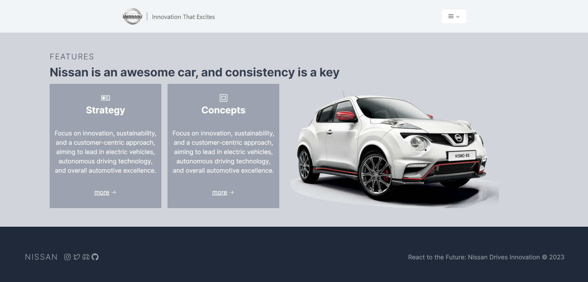
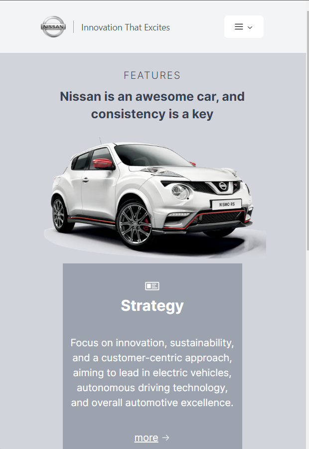

This is a [Next.js](https://nextjs.org/) project bootstrapped with [`create-next-app`](https://github.com/vercel/next.js/tree/canary/packages/create-next-app).

## NB!

Використано Next.js, Typescript, TailwindCSS, ShadcnUI

## Автор

Бобулич Ігор

## Хостінг

https://kpi-web-applications-labs.vercel.app/

## ЛАБ 1-2

Лабораторні роботи №1 та №2 зроблено в форматі 2в1, перегляньте результат за відповідними посиланнями.
Виконана адаптивна верстка, дотримано умови виконання лаборатоних робіт. 

## Скріншоти лабораторної роботи №3

 

 

